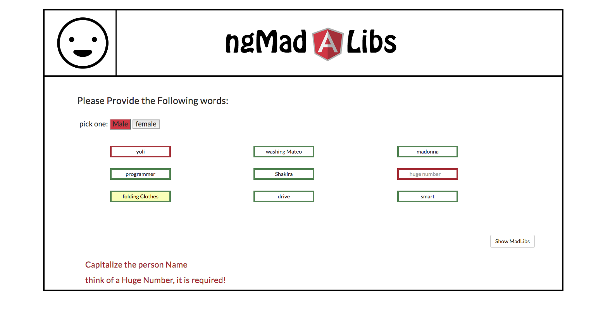
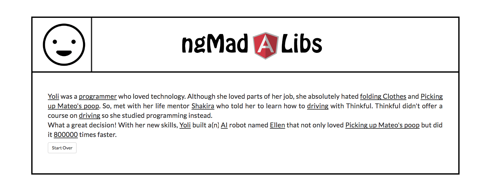

# madLibs
MadLibs using Angular: http://yolixtly.github.io/madLibs/

Initial View with Valiation

Results View 

Difficulties: 

- it has been 7 days since I start learning Angular, I really didnt understand how forms work but, shortly the path is getting more clear. 
	- My Bug was to display the results after my form has been completed or at least when I click the submit button. The problem is that I was mixing the functionality of ng-submit with validations. To solve my problem, I broke things in small problems by using Sudo Code. I realized the first step to solve my mind-puzzle was to undertand with more clarity what is ng-submit doing. Then I realized that creating a new method in my controller and calling it within ng-submit I will achieve my first goal: To render a new view, which in this case is my results view. 
	- Important to say is that I also made use of ng-show directive within the wrapper tag of my results. I passed a variable with a false value. Finally, in the method I called in the ng-submit directive I set a new value for this variable and set it to true. And Voila! the Mystery was solved! 

	-Once I thought It all was solved, I faced a problem regarding the controller's scope. Once I added the novalidate attribute to form and because I am using controller as syntax I didnt realized that the form's name property gets scoped to the controller's scope as well so I explicitly need to bind the form name with the alias.formName instead of just the name by itself. 

	So far, I am loving Angular! 